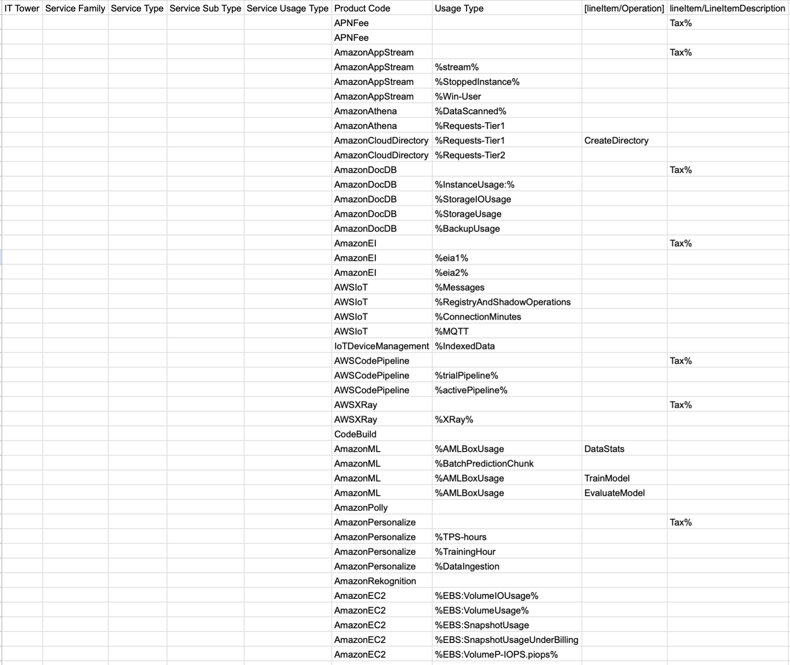
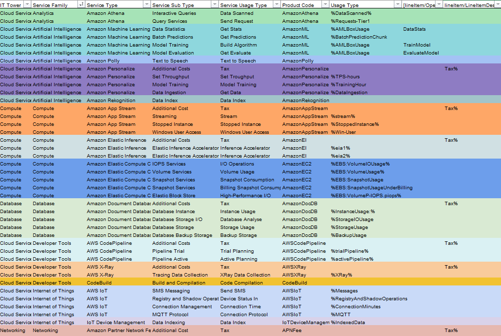

# Отчет по ЛР1 по облакам:
## Вариант 5
## Цель работы:
* Изучение облачных сервисов.
* Разбор уровней абстракции над инфраструктурой в облачной среде.
* Освоение принципов потребления сервисов в модели предоставления услуг.
## Задание:
Импортировать данные: Загрузить файл .csv в Excel или другую табличную программу и настроить данные для обработки.
Сопоставить и классифицировать: Соотнести данные с документацией провайдера, распределив потребление сервисов по иерархии от общей категории до конкретного использования.
## Ход работы:
Импортировали данные из файла.

После:

## Описание сервисов:

### Общие
* Additional Costs: Дополнительные расходы.
### Amazon Partner Network Fee
Комиссия для партнеров Amazon.
* Partner Network Fee: Плата за участие в партнерской сети Amazon.
### Amazon App Stream
Потоковая передача приложений через браузер.

* Streaming: Стриминг приложений и рабочих столов из облака.
* Stopped Instance: Расходы на остановленные экземпляры в AppStream.
* Windows User Access: Доступ к Windows-приложениям через AppStream.
### Amazon Athena
Анализ данных в S3 с SQL.

* Interactive Queries: Средство для выполнения SQL запросов в S3.
* Query Services: Обработка больших объемов данных в S3 с помощью SQL запросов.
### Amazon Cloud Directory
Управление облачными директориями и данными.

* Directory Services: Функционал управления каталогами данных.
### Amazon Document Database
NoSQL база данных для документов.

* Database Instance: Экземпляры Amazon DocumentDB для работы с документами.
* Database Storage I/O: Операции ввода-вывода в хранилище DocumentDB.
* Database Storage: Пространство для хранения данных в DocumentDB.
* Database Backup Storage: Хранилище для бэкапов DocumentDB.
### Amazon Elastic Inference
Ускорение работы ИИ-моделей.

* Elastic Inference Accelerator: Ускорение выполнения вычислений для ML.
### AWS IoT
Платформа для подключения IoT-устройств.

* SMS Messaging: Отправка сообщений SMS через IoT.
* Registry and Shadow Operations: Управление реестром устройств и их тенями.
* Connection Management: Поддержка соединений между IoT устройствами и облаком.
* MQTT Protocol: Использование протокола MQTT для IoT.
### IoT Device Management
Управление подключенными IoT-устройствами.

* Data Indexing: Индексация данных IoT.
### AWS CodePipeline
Автоматизация процессов CI/CD.

* Pipeline Trial: Пробная версия пайплайнов для CI/CD.
* Pipeline Active: Активные пайплайны для CI/CD.
### AWS X-Ray
Анализ производительности приложений.

* Tracing Data Collection: Сбор и анализ данных производительности приложений.
### CodeBuild
Автоматическая сборка и тестирование кода.

* Build and Compilation: Инструменты для автоматической сборки и компиляции кода.
### Amazon Machine Learning
Создание моделей машинного обучения.

* Data Statistics: Средства анализа данных для ML.
* Batch Predictions: Обработка и получение предсказаний с помощью ИИ.
* Model Training: Обучение моделей машинного обучения.
* Model Evaluation: Оценка качества обученных моделей.
### Amazon Polly
Синтез речи из текста.

* Text to Speech: Преобразование текста в речь.
### Amazon Personalize
Персонализированные рекомендации.

* Set Throughput: Настройка пропускной способности для персонализации.
* Model Training: Обучение моделей Amazon Personalize.
* Data Ingestion: Загрузка данных для работы с Amazon Personalize.
### Amazon Rekognition
Анализ медиа с помощью машинного зрения.

* Data Index: Индексация изображений и видео.
### Amazon Elastic Compute Cloud (EC2)
Аренда серверов для вычислений.

* IOPS Services: Опции для I/O-операций на блочных устройствах EC2.
* Volume Services: Управление вольюмами, подключенными к экземплярам EC2.
* Snapshot Services: Создание и восстановление снапшотов для EC2.
* Elastic Block Store (EBS): Хранилище для блочных устройств EC2 с возможностью расширения.
## Вывод:
В ходе работы мы изучили облачные сервисы AWS, проанализировали данные слепка биллинга и классифицировали предоставляемые услуги. 