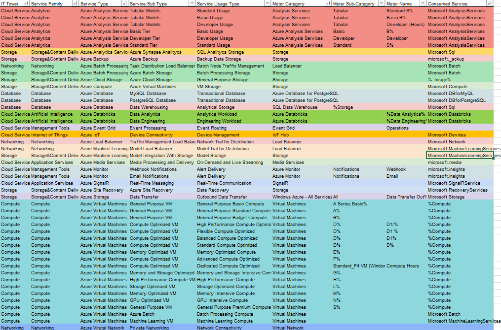

# Отчет ЛР2
## Вариант 5.

## Цель работы: 
* Получение навыков аналитики и понимания спектра публичных облачных сервисов без привязки к вендору. Формирование у студентов комплексного видения Облака. 
## Дано: 
* Данные лабораторной работы 1.
* Слепок данных биллинга от провайдера после небольшой обработки в виде SQL-параметров. Символ % в начале/конце означает, что перед/после него может стоять любой набор символов.
* Образец итогового соответствия, что желательно получить в конце. В этом же документе  
## Необходимо: 
* Импортировать файл .csv в Excel или любую другую программу работы с таблицами. Для Excel делается на вкладке Данные – Из текстового / csv файла – выбрать файл, разделитель – точка с запятой.
* Распределить потребление сервисов по иерархии, чтобы можно было провести анализ от большего к меньшему (напр. От всех вычислительных ресурсов Compute дойти до конкретного типа использования - Выделенной стойка в датацентре Dedicated host usage). При этом сохранять логическую концепцию, выработанную в Лабораторной работе 1.
* Сохранить файл и залить в соответствующую папку на Google Drive.
## Ход работы:
Импортировали файл:

Файл после обработки данных:

## Описание сервисов:
* __Azure Analysis Services__ — управление моделями для бизнес анализа.
* __Azure Analytics Services__ — анализ биг даты в риалтайм.
* __Azure Backup__ — бэкапы данных в облаке.
* __Azure Batch Processing__ — выполнение больших параллельных задач.
* __Azure Cloud Storage__ — хранилище данных.
* __Azure Compute__ — железо для выполнения вычислений для приложений.
* __Azure Database__ — бд SQL и NoSQL.
* __Azure Databricks__ — аналитика с помощью ML.
* __Azure Event Grid__ — маршрутизация событий.
* __Azure IoT__ — управление устройствами IoT.
* __Azure Load Balancer__ — балансировка трафика.
* __Azure Machine Learning__ — инструменты для ML.
* __Azure Media Services__ — обработка и трансляция медиа.
* __Azure Monitor__ — мониторинг телеметрии.
* __Azure SignalR__ — добавление риалтайм функций в веб-приложения.
* __Azure Site Recovery__ — аварийное восстановление.
* __Azure Virtual Machines__ — ВМки для запуска приложений под разные задачи.
* __Azure Virtual Network__ — изолированные сети.

