# Лабораторная №1
## Задание. Настроить nginx по заданному тз:

    * Должен работать по https c сертификатом
    * Настроить принудительное перенаправление HTTP-запросов (порт 80) на HTTPS (порт 443) для обеспечения безопасного соединения.
    * Использовать alias для создания псевдонимов путей к файлам или каталогам на сервере.
    * Настроить виртуальные хосты для обслуживания нескольких доменных имен на одном сервере.*

## Установим Ubuntu на VirtualBox:
Никто не ожидал, но проблемы начались уже здесь. При попытке установить версию Ubuntu 20.04.1 LTS было затрачено около 15 часов на загрузку, 2 часов на отлов всех ошибок, вылезающих во время запуска виртуальной машины. В итоге скачали 20.10 и больше не знали проблем.
А теперь к основной части... 

Сначала производим установку nginx. Делать это мы будем на ОС Linux, используя Virtualbox:
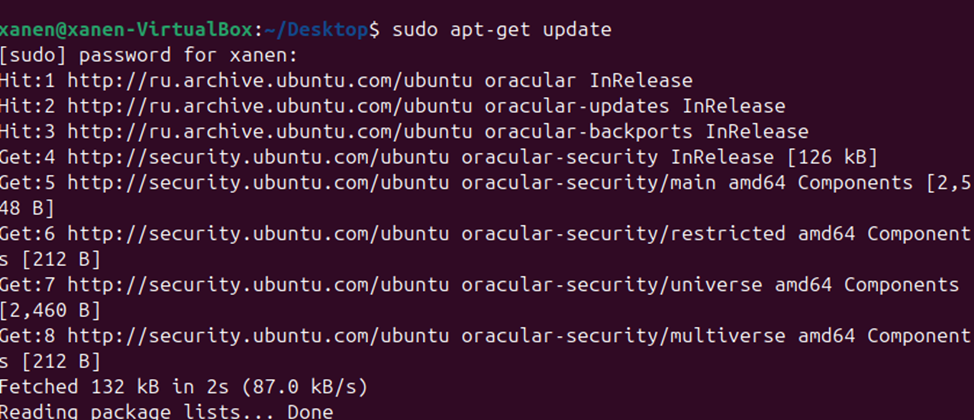

## Создаем локальные сайты project1 и project2
Пропишем домены _project1.local_ и _project2.local_ в _/etc/hosts_ :
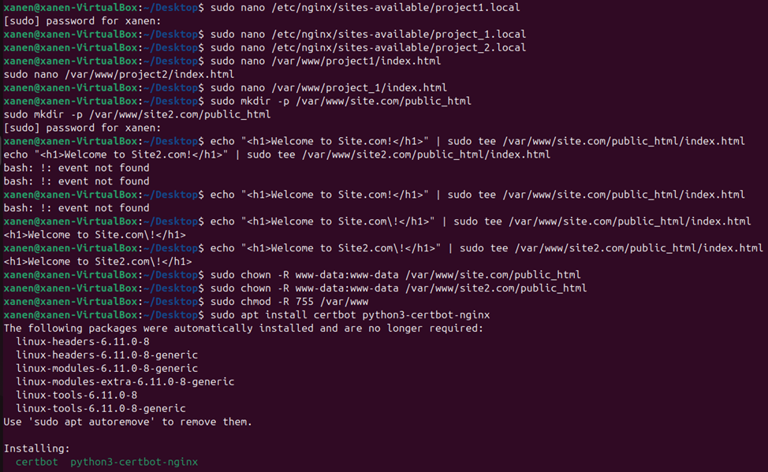

## Создание файлов конфигурации.
Для каждого из наших проектов нужно создать файл конфигурации, отвечающих ТЗ. Определяем server_name, также указываев, что сервер будет слушать запросы _http_ на порту 80 и, впоследствие, перенаправлять их на _https_.
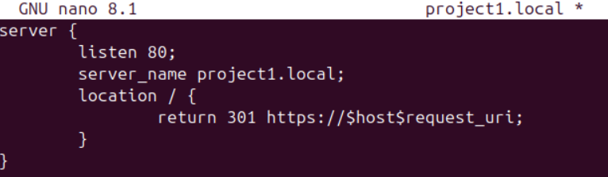

Теперь зададим настройки уже для самого https. Сайт должен работать с сертификатом, так что используем ssl, а также укажем пути к ssl файлам. За root возьмем index.html. 
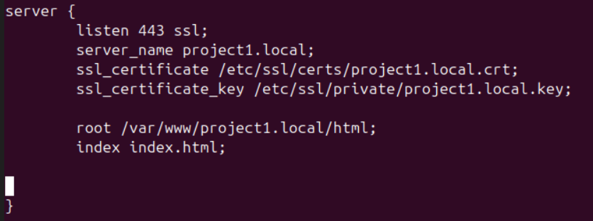
Изучив работу nginx, понимаем, что после создания наших файлов по пути _/etc/nginx/sites-available_ нам нужон их "активировать" - добавить в так называемую папку "включения" _sites-enabled_.
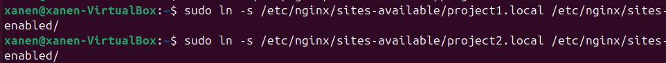

## Сертификаты ssl

При начале работы было несколько вариантов сделать ssl-сертификаты. Habr дал вариант попробовать Let's Encrypt/
_Let's Encrypt_ – это бесплатный, автоматизированный и открытый центр сертификации, созданный некоммерческой Internet Security Research Group (ISRG)

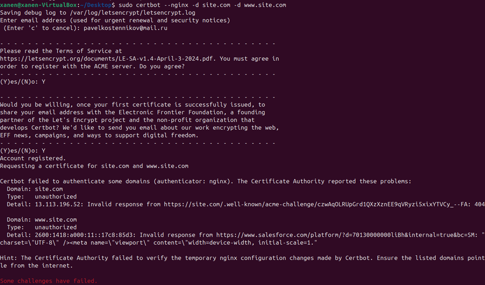

Попыток разобраться было немало и скорее всего все получилось бы, однако постоянные переезды вынудили пойти легким путем самоподписанных ssl сертификатов
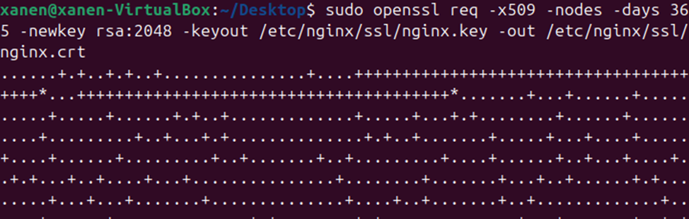

## Время проверки 
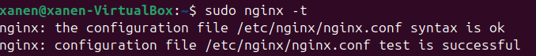
Как мы видим - файл кофигурации прошел проверку синтаксиса, а также тест, так что можем посмотреть работу наших проектов.

Иии.. снова проблемы 
Получили ошибку 403 Forbidden. Проверим, что не так. _(P.S. скриншот забыл сделать, а проблема вскоре исчезла)_

Попробовали в файл конфигурации добавить _autoindex on_. Помогло, НО теперь сайт нам дает ссылку на скачивание документа с заданным нами ранее текстом.
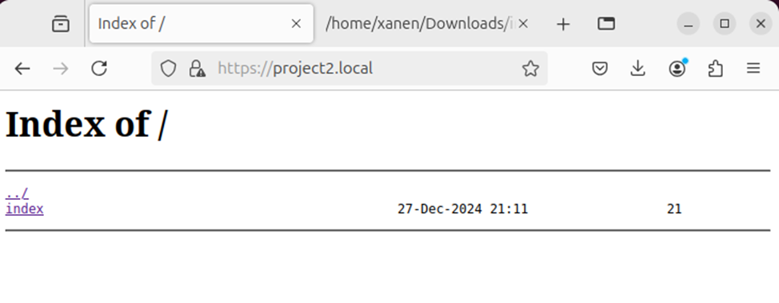

Чтобы это решить пришлось задать файлу _index_ нужный формат _.html_
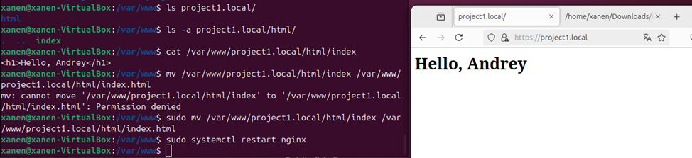
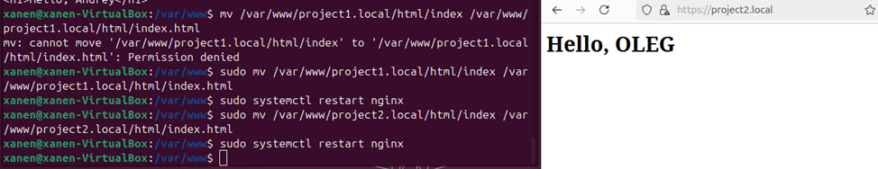

## Alias
Попробуем при обращении к project1 вывести картинку. Для этого создаем папку и скачиваем изображение в нее
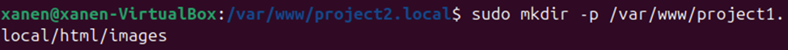
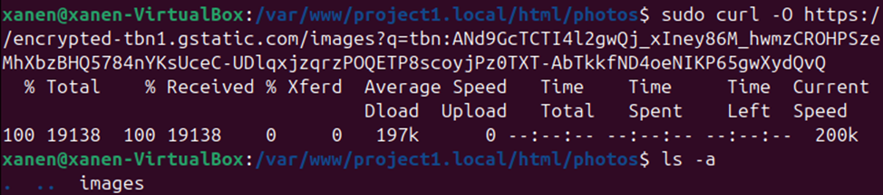
Налаживаем наш конфигурационный файл
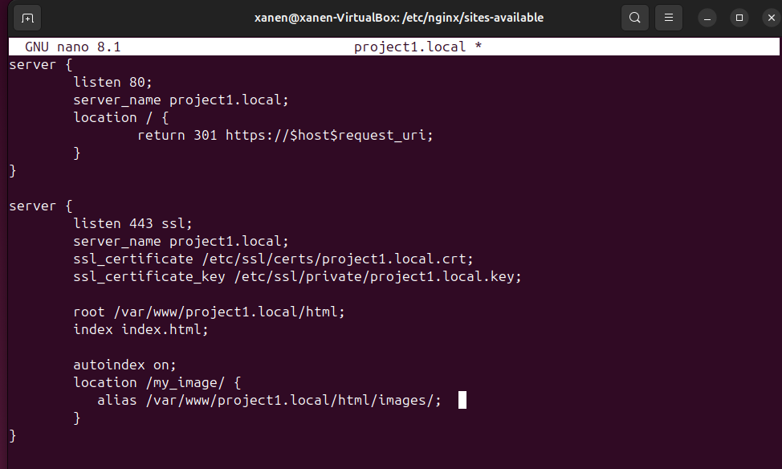
И наблюдаем положительный результат
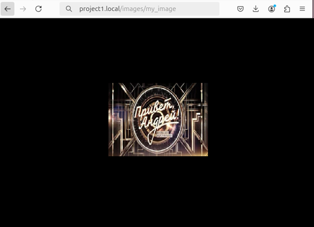

Таким образом, мы создали сайты и.... 
>Ну где ты был,
>Ну обними меня скорей!